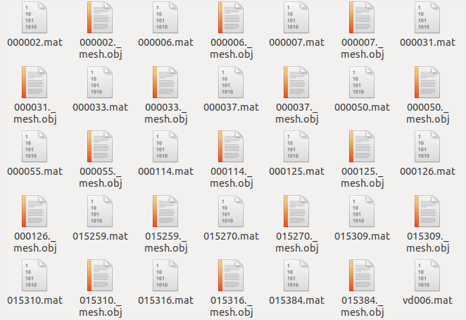
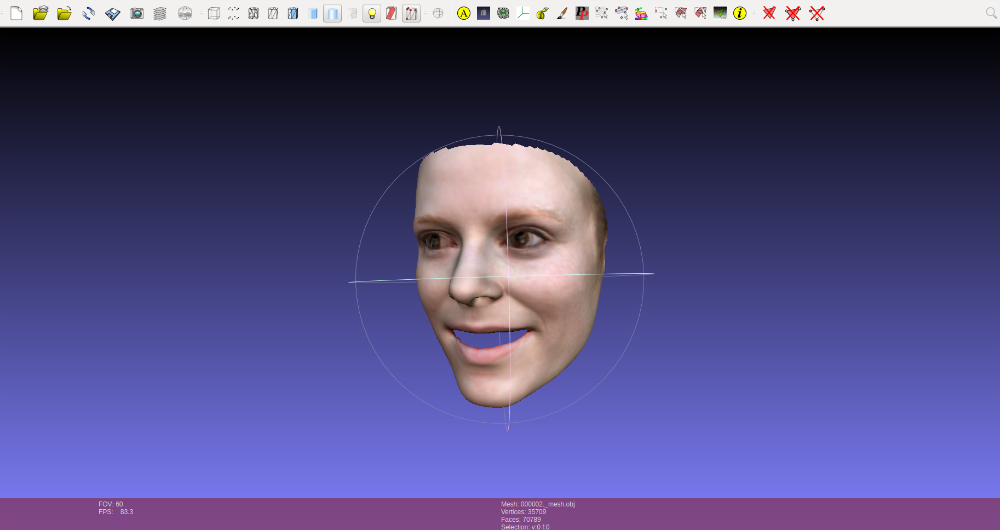
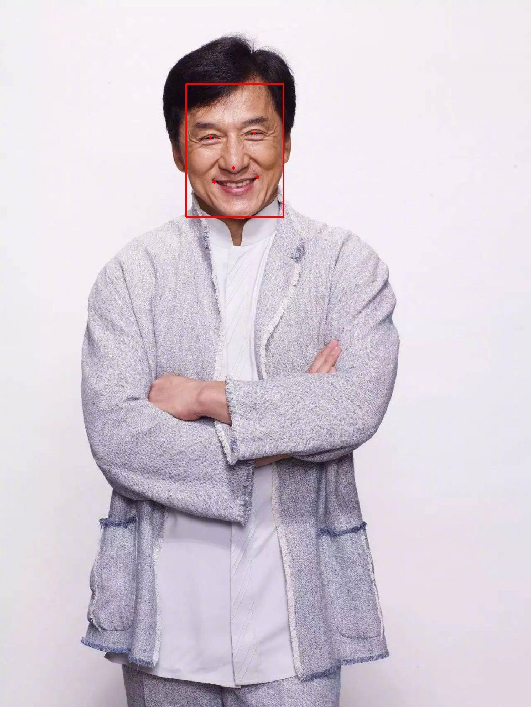
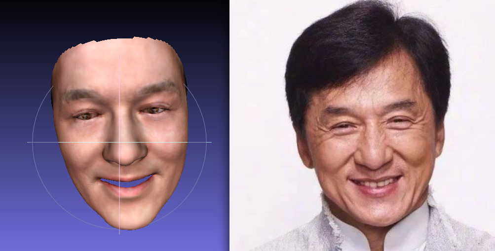
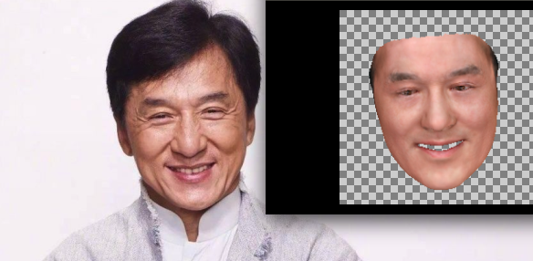
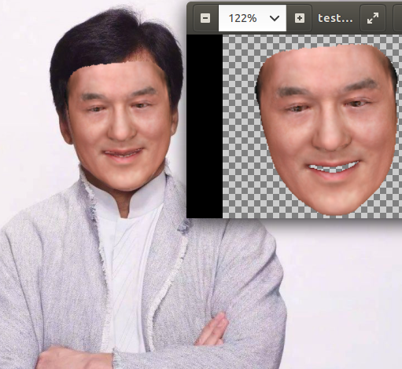

# 重建3D人脸


来自于论文 Y. Deng, J. Yang, S. Xu, D. Chen, Y. Jia, and X. Tong, [Accurate 3D Face Reconstruction with Weakly-Supervised Learning: From Single Image to Image Set](https://arxiv.org/abs/1903.08527), IEEE Computer Vision and Pattern Recognition Workshop (CVPRW) on Analysis and Modeling of Faces and Gestures (AMFG), 2019. (**_Best Paper Award!_**)

> 原仓库地址：https://github.com/microsoft/Deep3DFaceReconstruction

人脸模型主要通过3DMM模型，这个不详细叙述，5个参数主要是Identity,expression,texture,illumination和pose，而本篇论文就是从2D图像中预测出这5个参数，然后进行重建。

## 1.配置环境

需要Accurate 3D Face Reconstruction with Weakly-Supervised Learning: From Single Image to Image Set这篇论文的python源码实现。

**注意，只能在Linux下实现，Windows不可以**

>python=3.6
>
>tensorflow-gpu=1.9
>
>numpy
>
>scipy
>
>pillow
>
>opencv

这里建议按照上述的版本来，因为只有tensorflow1.9测试mesh_renderer成功

先仿照该项目的配置要求：

1. 克隆仓库

```bash
git clone https://github.com/Microsoft/Deep3DFaceReconstruction
cd Deep3DFaceReconstruction
```

2. Download the Basel Face Model. Due to the license agreement of Basel Face Model, you have to download the BFM09 model after submitting an application on its [home page](https://faces.dmi.unibas.ch/bfm/main.php?nav=1-2&id=downloads). After getting the access to BFM data, download "01_MorphableModel.mat" and put it into ./BFM subfolder.

3. Download the Expression Basis provided by [Guo et al.](https://github.com/Juyong/3DFace) You can find a link named "CoarseData" in the first row of Introduction part in their repository. Download and unzip the Coarse_Dataset.zip. Put "Exp_Pca.bin" into ./BFM subfolder. The expression basis are constructed using [Facewarehouse](kunzhou.net/zjugaps/facewarehouse/) data and transferred to BFM topology.

4. Download the trained [reconstruction network](https://drive.google.com/file/d/176LCdUDxAj7T2awQ5knPMPawq5Q2RUWM/view?usp=sharing), unzip it and put "FaceReconModel.pb" into ./network subfolder.

然后需要一个渲染工具，tf mesh renderer，直接pip安装，注意，需要tensorflow1.9版本下安装：

```
pip install mesh_renderer
```

5. 尝试运行程序测试重建3D人脸

```bash
python demo.py
```

如果正常，应该可以在output文件夹下找到很多的mat和obj文件

mat是matlab的一种文件保存方式，原文档对参数解释：

- “xxx.mat”:
  - cropped_img: an RGB image after alignment, which is the input to the R-Net
  - recon_img: an RGBA reconstruction image aligned with the input image.
  - coeff: output coefficients of R-Net.
  - face_shape: vertex positions of 3D face in the world coordinate.
  - face_texture: vertex texture of 3D face, which excludes lighting effect.
  - face_color: vertex color of 3D face, which takes lighting into consideration.
  - lm\_68p: 68 2D facial landmarks derived from the reconstructed 3D face. The 	landmarks are aligned with cropped_img.
  - lm\_5p: 5 detected landmarks aligned with cropped_img. 

- "xxx.obj"：一种3D模型保存格式

  

## 2.可视化3D模型：

安装meshlab查看obj模型：

```
sudo add-apt-repository ppa:zarquon42/meshlab
sudo apt-get update
sudo apt-get install meshlab
```

然后先从电脑中启动meshlab

再将obj文件拖入

效果：



## 3.对任意一个人脸重建：

可以发现，input文件夹下，有一个txt文件，是人脸的5个关键点。这个需要用来对齐人脸再提取特征，因此需要用MTCNN来计算。

MTCNN需要安装，可能与现有环境不兼容，因此先在Deep3DFaceReconstruction中，克隆一个仓库。

这个仓库是我经过修改，已在tf1.9上测试完毕了。

```
git clone https://github.com/RuoyuChen10/MTCNN_Portable.git
```

可以进入这个克隆文件进行测试：

```
cd MTCNN_Portable
python test.py
```

如果成功，将成功检测到成龙的脸。



然后回去主目录

```
cd ..
```

新建一个脚本文件`demo_single_face.py`测试单个人脸，注意是，这里不需要提供txt放人脸坐标，直接通过MTCNN直接检测5个关键点坐标

```python
import tensorflow as tf 
import numpy as np
from PIL import Image
import os
import sys
import glob
import cv2
import platform
from scipy.io import loadmat,savemat

from preprocess_img import Preprocess
from load_data import *
from face_decoder import Face3D

from MTCNN_Portable.mtcnn import MTCNN
import argparse

sys.path.append("./MTCNN_Portable")

is_windows = platform.system() == "Windows"

def load_graph(graph_filename):
	with tf.gfile.GFile(graph_filename,'rb') as f:
		graph_def = tf.GraphDef()
		graph_def.ParseFromString(f.read())

	return graph_def

def demo(args):
	# input and output folder
	image_path = args.input
	save_path = args.output
	if not os.path.exists(save_path):
		os.makedirs(save_path)

	# read BFM face model
	# transfer original BFM model to our model
	if not os.path.isfile('./BFM/BFM_model_front.mat'):
		transferBFM09()

	# read standard landmarks for preprocessing images
	lm3D = load_lm3d()
	batchsize = 1

	# build reconstruction model
	with tf.Graph().as_default() as graph,tf.device('/gpu:0'):

		FaceReconstructor = Face3D()
		images = tf.placeholder(name = 'input_imgs', shape = [batchsize,224,224,3], dtype = tf.float32)
		graph_def = load_graph('network/FaceReconModel.pb')
		tf.import_graph_def(graph_def,name='resnet',input_map={'input_imgs:0': images})

		# output coefficients of R-Net (dim = 257)
		coeff = graph.get_tensor_by_name('resnet/coeff:0')

		# reconstructing faces
		FaceReconstructor.Reconstruction_Block(coeff,batchsize)
		face_shape = FaceReconstructor.face_shape_t
		face_texture = FaceReconstructor.face_texture
		face_color = FaceReconstructor.face_color
		landmarks_2d = FaceReconstructor.landmark_p
		recon_img = FaceReconstructor.render_imgs
		tri = FaceReconstructor.facemodel.face_buf

		detector = MTCNN()
		img,lm = load_img_and_lm(image_path, detector)

		with tf.Session() as sess:
			print('reconstructing...')
			# load images and corresponding 5 facial landmarks
			
			# preprocess input image
			input_img,lm_new,transform_params = Preprocess(img,lm,lm3D)

			coeff_,face_shape_,face_texture_,face_color_,landmarks_2d_,recon_img_,tri_ = sess.run([coeff,\
				face_shape,face_texture,face_color,landmarks_2d,recon_img,tri],feed_dict = {images: input_img})


			# reshape outputs
			input_img = np.squeeze(input_img)
			face_shape_ = np.squeeze(face_shape_, (0))
			face_texture_ = np.squeeze(face_texture_, (0))
			face_color_ = np.squeeze(face_color_, (0))
			landmarks_2d_ = np.squeeze(landmarks_2d_, (0))
			if not is_windows:
				recon_img_ = np.squeeze(recon_img_, (0))

			# save output files
			if not is_windows:
				savemat(os.path.join(save_path,image_path.split(os.path.sep)[-1].replace('.png','.mat').replace('jpg','mat')),{'cropped_img':input_img[:,:,::-1],'recon_img':recon_img_,'coeff':coeff_,\
					'face_shape':face_shape_,'face_texture':face_texture_,'face_color':face_color_,'lm_68p':landmarks_2d_,'lm_5p':lm_new})
			save_obj(os.path.join(save_path,image_path.split(os.path.sep)[-1].replace('.png','_mesh.obj').replace('jpg','_mesh.obj')),face_shape_,tri_,np.clip(face_color_,0,255)/255) # 3D reconstruction face (in canonical view)

# load input images and corresponding 5 landmarks
def load_img_and_lm(img_path, detector):
	print("Reading image")
	image = Image.open(img_path)
	img = cv2.cvtColor(cv2.imread(img_path), cv2.COLOR_BGR2RGB)
	print("Detect 5 key point")
	face = detector.detect_faces(img)[0]
	left_eye = face["keypoints"]["left_eye"]
	right_eye = face["keypoints"]["right_eye"]
	nose = face["keypoints"]["nose"]
	mouth_left = face["keypoints"]["mouth_left"]
	mouth_right = face["keypoints"]["mouth_right"]
	lm = np.array([[left_eye[0], left_eye[1]],
				[right_eye[0], right_eye[1]],
				[nose[0], nose[1]],
				[mouth_left[0], mouth_left[1]],
				[mouth_right[0], mouth_right[1]]])
	return image,lm

if __name__ == '__main__':
	parser = argparse.ArgumentParser()
	parser.add_argument('--input', type=str, default='./MTCNN_Portable/test.jpg',help='Path of input image')
	parser.add_argument('--output', type=str, default='./output',
						help='Path of output fold')
	arguments = parser.parse_args()
	demo(arguments)

```

注意修改输入和输出的路径

然后看看重建的成龙：



## 4.将人脸渲染到2D图像：

首先先添加一个文件`renderer.py`中，这时我们就需要用到`mesh_renderer`库来渲染模型了。具体函数便不解释了，细看。

```python
import tensorflow as tf
import mesh_renderer
from scipy.io import loadmat,savemat
import numpy as np

# define facemodel for reconstruction
class BFM():
	def __init__(self):
		model_path = './BFM/BFM_model_front.mat'
		model = loadmat(model_path)
		self.meanshape = model['meanshape'] # mean face shape 
		self.idBase = model['idBase'] # identity basis
		self.exBase = model['exBase'] # expression basis
		self.meantex = model['meantex'] # mean face texture
		self.texBase = model['texBase'] # texture basis
		self.point_buf = model['point_buf'] # adjacent face index for each vertex, starts from 1 (only used for calculating face normal)
		self.tri = model['tri'] # vertex index for each triangle face, starts from 1
		self.keypoints = np.squeeze(model['keypoints']).astype(np.int32) - 1 # 68 face landmark index, starts from 0

# compute vertex normal using one-ring neighborhood
# input: face_shape with shape [1,N,3]
# output: v_norm with shape [1,N,3]
def Compute_norm(face_shape,facemodel):

	face_id = facemodel.tri # vertex index for each triangle face, with shape [F,3], F is number of faces
	point_id = facemodel.point_buf # adjacent face index for each vertex, with shape [N,8], N is number of vertex
	shape = face_shape
	face_id = (face_id - 1).astype(np.int32)
	point_id = (point_id - 1).astype(np.int32)
	v1 = shape[:,face_id[:,0],:]
	v2 = shape[:,face_id[:,1],:]
	v3 = shape[:,face_id[:,2],:]
	e1 = v1 - v2
	e2 = v2 - v3
	face_norm = np.cross(e1,e2) # compute normal for each face
	face_norm = np.concatenate([face_norm,np.zeros([1,1,3])], axis = 1) # concat face_normal with a zero vector at the end
	v_norm = np.sum(face_norm[:,point_id,:], axis = 2) # compute vertex normal using one-ring neighborhood
	v_norm = v_norm/np.expand_dims(np.linalg.norm(v_norm,axis = 2),2) # normalize normal vectors

	return v_norm

# input: coeff with shape [1,257]
def Split_coeff(coeff):
	id_coeff = coeff[:,:80] # identity(shape) coeff of dim 80
	ex_coeff = coeff[:,80:144] # expression coeff of dim 64
	tex_coeff = coeff[:,144:224] # texture(albedo) coeff of dim 80
	angles = coeff[:,224:227] # ruler angles(x,y,z) for rotation of dim 3
	gamma = coeff[:,227:254] # lighting coeff for 3 channel SH function of dim 27
	translation = coeff[:,254:] # translation coeff of dim 3

	return id_coeff,ex_coeff,tex_coeff,angles,gamma,translation

# compute vertex texture(albedo) with tex_coeff
# input: tex_coeff with shape [1,N,3]
# output: face_texture with shape [1,N,3], RGB order, range from 0-255
def Texture_formation(tex_coeff,facemodel):

	face_texture = np.einsum('ij,aj->ai',facemodel.texBase,tex_coeff) + facemodel.meantex
	face_texture = np.reshape(face_texture,[1,-1,3])

	return face_texture

# compute rotation matrix based on 3 ruler angles
# input: angles with shape [1,3]
# output: rotation matrix with shape [1,3,3]
def Compute_rotation_matrix(angles):

	angle_x = angles[:,0][0]
	angle_y = angles[:,1][0]
	angle_z = angles[:,2][0]

	# compute rotation matrix for X,Y,Z axis respectively
	rotation_X = np.array([1.0,0,0,\
		0,np.cos(angle_x),-np.sin(angle_x),\
		0,np.sin(angle_x),np.cos(angle_x)])
	rotation_Y = np.array([np.cos(angle_y),0,np.sin(angle_y),\
		0,1,0,\
		-np.sin(angle_y),0,np.cos(angle_y)])
	rotation_Z = np.array([np.cos(angle_z),-np.sin(angle_z),0,\
		np.sin(angle_z),np.cos(angle_z),0,\
		0,0,1])

	rotation_X = np.reshape(rotation_X,[1,3,3])
	rotation_Y = np.reshape(rotation_Y,[1,3,3])
	rotation_Z = np.reshape(rotation_Z,[1,3,3])

	rotation = np.matmul(np.matmul(rotation_Z,rotation_Y),rotation_X)
	rotation = np.transpose(rotation, axes = [0,2,1])  #transpose row and column (dimension 1 and 2)

	return rotation

# compute vertex color using face_texture and SH function lighting approximation
# input: face_texture with shape [1,N,3]
# 	     norm with shape [1,N,3]
#		 gamma with shape [1,27]
# output: face_color with shape [1,N,3], RGB order, range from 0-255
#		  lighting with shape [1,N,3], color under uniform texture
def Illumination_layer(face_texture,norm,gamma):

	num_vertex = np.shape(face_texture)[1]

	init_lit = np.array([0.8,0,0,0,0,0,0,0,0])
	gamma = np.reshape(gamma,[-1,3,9])
	gamma = gamma + np.reshape(init_lit,[1,1,9])

	# parameter of 9 SH function
	a0 = np.pi 
	a1 = 2*np.pi/np.sqrt(3.0)
	a2 = 2*np.pi/np.sqrt(8.0)
	c0 = 1/np.sqrt(4*np.pi)
	c1 = np.sqrt(3.0)/np.sqrt(4*np.pi)
	c2 = 3*np.sqrt(5.0)/np.sqrt(12*np.pi)

	Y0 = np.tile(np.reshape(a0*c0,[1,1,1]),[1,num_vertex,1]) 
	Y1 = np.reshape(-a1*c1*norm[:,:,1],[1,num_vertex,1]) 
	Y2 = np.reshape(a1*c1*norm[:,:,2],[1,num_vertex,1])
	Y3 = np.reshape(-a1*c1*norm[:,:,0],[1,num_vertex,1])
	Y4 = np.reshape(a2*c2*norm[:,:,0]*norm[:,:,1],[1,num_vertex,1])
	Y5 = np.reshape(-a2*c2*norm[:,:,1]*norm[:,:,2],[1,num_vertex,1])
	Y6 = np.reshape(a2*c2*0.5/np.sqrt(3.0)*(3*np.square(norm[:,:,2])-1),[1,num_vertex,1])
	Y7 = np.reshape(-a2*c2*norm[:,:,0]*norm[:,:,2],[1,num_vertex,1])
	Y8 = np.reshape(a2*c2*0.5*(np.square(norm[:,:,0])-np.square(norm[:,:,1])),[1,num_vertex,1])

	Y = np.concatenate([Y0,Y1,Y2,Y3,Y4,Y5,Y6,Y7,Y8],axis=2)

	# Y shape:[batch,N,9].

	lit_r = np.squeeze(np.matmul(Y,np.expand_dims(gamma[:,0,:],2)),2) #[batch,N,9] * [batch,9,1] = [batch,N]
	lit_g = np.squeeze(np.matmul(Y,np.expand_dims(gamma[:,1,:],2)),2)
	lit_b = np.squeeze(np.matmul(Y,np.expand_dims(gamma[:,2,:],2)),2)

	# shape:[batch,N,3]
	face_color = np.stack([lit_r*face_texture[:,:,0],lit_g*face_texture[:,:,1],lit_b*face_texture[:,:,2]],axis = 2)
	lighting = np.stack([lit_r,lit_g,lit_b],axis = 2)*128

	return face_color,lighting

def Illumination_inv_layer(face_color,lighting):
	face_texture = np.stack([face_color[:,:,0]/lighting[:,:,0],face_color[:,:,1]/lighting[:,:,1],face_color[:,:,2]/lighting[:,:,2]],axis=2)*128
	return face_texture

# compute face shape with identity and expression coeff, based on BFM model
# input: id_coeff with shape [1,80]
#		 ex_coeff with shape [1,64]
# output: face_shape with shape [1,N,3], N is number of vertices
def Shape_formation(id_coeff,ex_coeff,facemodel):
	face_shape = np.einsum('ij,aj->ai',facemodel.idBase,id_coeff) + \
				np.einsum('ij,aj->ai',facemodel.exBase,ex_coeff) + \
				facemodel.meanshape

	face_shape = np.reshape(face_shape,[1,-1,3])
	# re-center face shape
	face_shape = face_shape - np.mean(np.reshape(facemodel.meanshape,[1,-1,3]), axis = 1, keepdims = True)

	return face_shape

def Reconstruction_for_render(coeff,facemodel):
	id_coeff,ex_coeff,tex_coeff,angles,gamma,translation = Split_coeff(coeff)
	face_shape = Shape_formation(id_coeff, ex_coeff, facemodel)
	face_texture = Texture_formation(tex_coeff, facemodel)
	face_norm = Compute_norm(face_shape,facemodel)
	rotation = Compute_rotation_matrix(angles)
	face_shape_r = np.matmul(face_shape,rotation)
	face_shape_r = face_shape_r + np.reshape(translation,[1,1,3])
	face_norm_r = np.matmul(face_norm,rotation)
	face_color,lighting = Illumination_layer(face_texture, face_norm_r, gamma)
	tri = facemodel.tri
	
	return face_shape_r,face_norm_r,face_color,tri

def Render_layer(face_shape,face_norm,face_color,facemodel,batchsize):

	camera_position = tf.constant([0,0,10.0])
	camera_lookat = tf.constant([0,0,0.0])
	camera_up = tf.constant([0,1.0,0])
	light_positions = tf.tile(tf.reshape(tf.constant([0,0,1e5]),[1,1,3]),[batchsize,1,1])
	light_intensities = tf.tile(tf.reshape(tf.constant([0.0,0.0,0.0]),[1,1,3]),[batchsize,1,1])
	ambient_color = tf.tile(tf.reshape(tf.constant([1.0,1,1]),[1,3]),[batchsize,1])

	#pdb.set_trace()
	render = mesh_renderer.mesh_renderer(face_shape,
		tf.cast(facemodel.tri-1,tf.int32),
		face_norm,
		face_color/255,
		camera_position = camera_position,
		camera_lookat = camera_lookat,
		camera_up = camera_up,
		light_positions = light_positions,
		light_intensities = light_intensities,
		image_width = 224,
		image_height = 224,
		fov_y = 12.5936,
		ambient_color = ambient_color)

	return render
```

这里再用`demo_single_face.py`文件调用这个文件对人脸进行渲染，修改如下：

```python
import tensorflow as tf 
import numpy as np
from PIL import Image
import os
import sys
import glob
import cv2
import platform
from scipy.io import loadmat,savemat

from preprocess_img import Preprocess
from load_data import *
from face_decoder import Face3D

from MTCNN_Portable.mtcnn import MTCNN
import argparse

from renderer import *


sys.path.append("./MTCNN_Portable")

is_windows = platform.system() == "Windows"

def load_graph(graph_filename):
	with tf.gfile.GFile(graph_filename,'rb') as f:
		graph_def = tf.GraphDef()
		graph_def.ParseFromString(f.read())

	return graph_def

def demo(args):
	# input and output folder
	image_path = args.input
	save_path = args.output
	if not os.path.exists(save_path):
		os.makedirs(save_path)

	# read BFM face model
	facemodel = BFM()
	# transfer original BFM model to our model
	if not os.path.isfile('./BFM/BFM_model_front.mat'):
		transferBFM09()

	# read standard landmarks for preprocessing images
	lm3D = load_lm3d()
	batchsize = 1

	# build reconstruction model
	with tf.Graph().as_default() as graph,tf.device('/gpu:0'):

		FaceReconstructor = Face3D()
		images = tf.placeholder(name = 'input_imgs', shape = [batchsize,224,224,3], dtype = tf.float32)
		graph_def = load_graph('network/FaceReconModel.pb')
		tf.import_graph_def(graph_def,name='resnet',input_map={'input_imgs:0': images})

		# output coefficients of R-Net (dim = 257)
		coeff = graph.get_tensor_by_name('resnet/coeff:0')

		with tf.device('/cpu:0'):
			# renderer layer
			faceshaper = tf.placeholder(name = "face_shape_r", shape = [1,35709,3], dtype = tf.float32)
			facenormr = tf.placeholder(name = "face_norm_r", shape = [1,35709,3], dtype = tf.float32)
			facecolor = tf.placeholder(name = "face_color", shape = [1,35709,3], dtype = tf.float32)
			rendered = Render_layer(faceshaper,facenormr,facecolor,facemodel,1)

			rstimg = tf.placeholder(name = 'rstimg', shape = [224,224,4], dtype=tf.uint8)
			encode_png = tf.image.encode_png(rstimg)

		# reconstructing faces
		FaceReconstructor.Reconstruction_Block(coeff,batchsize)
		face_shape = FaceReconstructor.face_shape_t
		face_texture = FaceReconstructor.face_texture
		face_color = FaceReconstructor.face_color
		landmarks_2d = FaceReconstructor.landmark_p
		recon_img = FaceReconstructor.render_imgs
		tri = FaceReconstructor.facemodel.face_buf

		# MTCNN Detector
		detector = MTCNN()
		img,lm = load_img_and_lm(image_path, detector)

		with tf.Session() as sess:
			print('reconstructing...')
			# load images and corresponding 5 facial landmarks
			
			# preprocess input image
			input_img,lm_new,transform_params = Preprocess(img,lm,lm3D)

			coeff_,face_shape_,face_texture_,face_color_,landmarks_2d_,recon_img_,tri_ = sess.run([coeff,\
				face_shape,face_texture,face_color,landmarks_2d,recon_img,tri],feed_dict = {images: input_img})

			# renderer output
			face_shape_r,face_norm_r,face_color,tri = Reconstruction_for_render(coeff_,facemodel)
			final_images = sess.run(rendered, feed_dict={faceshaper: face_shape_r.astype('float32'), facenormr: face_norm_r.astype('float32'), facecolor: face_color.astype('float32')})
			result_image = final_images[0, :, :, :]
			result_image = np.clip(result_image, 0., 1.).copy(order='C')
			result_bytes = sess.run(encode_png,{rstimg: result_image*255.0})
			result_output_path = os.path.join(save_path, image_path.split(os.path.sep)[-1].replace('.png','_render.png').replace('jpg','_render.png'))
			with open(result_output_path, 'wb') as output_file:
				output_file.write(result_bytes)


			# reshape outputs
			input_img = np.squeeze(input_img)
			face_shape_ = np.squeeze(face_shape_, (0))
			face_texture_ = np.squeeze(face_texture_, (0))
			face_color_ = np.squeeze(face_color_, (0))
			landmarks_2d_ = np.squeeze(landmarks_2d_, (0))
			if not is_windows:
				recon_img_ = np.squeeze(recon_img_, (0))

			# save output files
			if not is_windows:
				savemat(os.path.join(save_path,image_path.split(os.path.sep)[-1].replace('.png','.mat').replace('jpg','mat')),{'cropped_img':input_img[:,:,::-1],'recon_img':recon_img_,'coeff':coeff_,\
					'face_shape':face_shape_,'face_texture':face_texture_,'face_color':face_color_,'lm_68p':landmarks_2d_,'lm_5p':lm_new})
			save_obj(os.path.join(save_path,image_path.split(os.path.sep)[-1].replace('.png','_mesh.obj').replace('jpg','_mesh.obj')),face_shape_,tri_,np.clip(face_color_,0,255)/255) # 3D reconstruction face (in canonical view)

# load input images and corresponding 5 landmarks
def load_img_and_lm(img_path, detector):
	print("Reading image")
	image = Image.open(img_path)
	img = cv2.cvtColor(cv2.imread(img_path), cv2.COLOR_BGR2RGB)
	print("Detect 5 key point")
	face = detector.detect_faces(img)[0]
	left_eye = face["keypoints"]["left_eye"]
	right_eye = face["keypoints"]["right_eye"]
	nose = face["keypoints"]["nose"]
	mouth_left = face["keypoints"]["mouth_left"]
	mouth_right = face["keypoints"]["mouth_right"]
	lm = np.array([[left_eye[0], left_eye[1]],
				[right_eye[0], right_eye[1]],
				[nose[0], nose[1]],
				[mouth_left[0], mouth_left[1]],
				[mouth_right[0], mouth_right[1]]])
	return image,lm

if __name__ == '__main__':
	parser = argparse.ArgumentParser()
	parser.add_argument('--input', type=str, default='./MTCNN_Portable/mqr.jpg',help='Path of input image')
	parser.add_argument('--output', type=str, default='./output',
						help='Path of output fold')
	arguments = parser.parse_args()
	demo(arguments)

```

运行程序

```shell
python demo_single_face.py --input <your image input path> --output <Path of output fold>
```

然后得到生成的结果：



## 5.将渲染的人脸贴回原图：

原理也比较简单，从程序中找到他提取脸部位置的坐标和缩放大小，然后将渲染的人脸还回去，注意的几条：

- RGBA图像是4通道，一般在读取为RGB通道时候直接读前3个通道就可以了，第4个通道有关透明度，可以不加。
- 将图像贴回原图时候，注意渲染的图像别超界原图

先修改`preprocess_img.py`的两个函数，`process_img`和`Procsss`，全部命令如下：

```python
import numpy as np 
from scipy.io import loadmat,savemat
from PIL import Image

#calculating least square problem
def POS(xp,x):
	npts = xp.shape[1]

	A = np.zeros([2*npts,8])

	A[0:2*npts-1:2,0:3] = x.transpose()
	A[0:2*npts-1:2,3] = 1

	A[1:2*npts:2,4:7] = x.transpose()
	A[1:2*npts:2,7] = 1;

	b = np.reshape(xp.transpose(),[2*npts,1])

	k,_,_,_ = np.linalg.lstsq(A,b)

	R1 = k[0:3]
	R2 = k[4:7]
	sTx = k[3]
	sTy = k[7]
	s = (np.linalg.norm(R1) + np.linalg.norm(R2))/2
	t = np.stack([sTx,sTy],axis = 0)

	return t,s

def process_img(img,lm,t,s,target_size = 224.):
	w0,h0 = img.size
	w = (w0/s*102).astype(np.int32)
	h = (h0/s*102).astype(np.int32)
	img = img.resize((w,h),resample = Image.BICUBIC)

	left = (w/2 - target_size/2 + float((t[0] - w0/2)*102/s)).astype(np.int32)
	right = left + target_size
	up = (h/2 - target_size/2 + float((h0/2 - t[1])*102/s)).astype(np.int32)
	below = up + target_size

	img = img.crop((left,up,right,below))
	img = np.array(img)
	img = img[:,:,::-1] #RGBtoBGR
	img = np.expand_dims(img,0)
	lm = np.stack([lm[:,0] - t[0] + w0/2,lm[:,1] - t[1] + h0/2],axis = 1)/s*102
	lm = lm - np.reshape(np.array([(w/2 - target_size/2),(h/2-target_size/2)]),[1,2])

	return img,lm,[left,right,up,below,w0/w]


# resize and crop input images before sending to the R-Net
def Preprocess(img,lm,lm3D):

	w0,h0 = img.size

	# change from image plane coordinates to 3D sapce coordinates(X-Y plane)
	lm = np.stack([lm[:,0],h0 - 1 - lm[:,1]], axis = 1)

	# calculate translation and scale factors using 5 facial landmarks and standard landmarks of a 3D face
	t,s = POS(lm.transpose(),lm3D.transpose())

	# processing the image
	img_new,lm_new,posion = process_img(img,lm,t,s)
	lm_new = np.stack([lm_new[:,0],223 - lm_new[:,1]], axis = 1)
	trans_params = np.array([w0,h0,102.0/s,t[0],t[1]])
	
	return img_new,lm_new,trans_params,posion
```

程序如下，依然是修改`demo_single_face.py`：

```python
import tensorflow as tf 
import numpy as np
from PIL import Image
import os
import sys
import glob
import cv2
import platform
from scipy.io import loadmat,savemat

from preprocess_img import Preprocess
from load_data import *
from face_decoder import Face3D

from MTCNN_Portable.mtcnn import MTCNN
import argparse

from renderer import *


sys.path.append("./MTCNN_Portable")

is_windows = platform.system() == "Windows"

def load_graph(graph_filename):
	with tf.gfile.GFile(graph_filename,'rb') as f:
		graph_def = tf.GraphDef()
		graph_def.ParseFromString(f.read())

	return graph_def

def demo(args):
	# input and output folder
	image_path = args.input
	save_path = args.output
	if not os.path.exists(save_path):
		os.makedirs(save_path)

	# read BFM face model
	facemodel = BFM()
	# transfer original BFM model to our model
	if not os.path.isfile('./BFM/BFM_model_front.mat'):
		transferBFM09()

	# read standard landmarks for preprocessing images
	lm3D = load_lm3d()
	batchsize = 1

	# build reconstruction model
	with tf.Graph().as_default() as graph,tf.device('/gpu:0'):

		FaceReconstructor = Face3D()
		images = tf.placeholder(name = 'input_imgs', shape = [batchsize,224,224,3], dtype = tf.float32)
		graph_def = load_graph('network/FaceReconModel.pb')
		tf.import_graph_def(graph_def,name='resnet',input_map={'input_imgs:0': images})

		# output coefficients of R-Net (dim = 257)
		coeff = graph.get_tensor_by_name('resnet/coeff:0')

		with tf.device('/cpu:0'):
			# renderer layer
			faceshaper = tf.placeholder(name = "face_shape_r", shape = [1,35709,3], dtype = tf.float32)
			facenormr = tf.placeholder(name = "face_norm_r", shape = [1,35709,3], dtype = tf.float32)
			facecolor = tf.placeholder(name = "face_color", shape = [1,35709,3], dtype = tf.float32)
			rendered = Render_layer(faceshaper,facenormr,facecolor,facemodel,1)

			rstimg = tf.placeholder(name = 'rstimg', shape = [224,224,4], dtype=tf.uint8)
			encode_png = tf.image.encode_png(rstimg)

		# reconstructing faces
		FaceReconstructor.Reconstruction_Block(coeff,batchsize)
		face_shape = FaceReconstructor.face_shape_t
		face_texture = FaceReconstructor.face_texture
		face_color = FaceReconstructor.face_color
		landmarks_2d = FaceReconstructor.landmark_p
		recon_img = FaceReconstructor.render_imgs
		tri = FaceReconstructor.facemodel.face_buf

		# MTCNN Detector
		detector = MTCNN()
		img,lm = load_img_and_lm(image_path, detector)

		with tf.Session() as sess:
			print('reconstructing...')
			# load images and corresponding 5 facial landmarks
			
			# preprocess input image
			input_img,lm_new,transform_params,posion = Preprocess(img,lm,lm3D)

			coeff_,face_shape_,face_texture_,face_color_,landmarks_2d_,recon_img_,tri_ = sess.run([coeff,\
				face_shape,face_texture,face_color,landmarks_2d,recon_img,tri],feed_dict = {images: input_img})

			# renderer output
			face_shape_r,face_norm_r,face_color,tri = Reconstruction_for_render(coeff_,facemodel)
			final_images = sess.run(rendered, feed_dict={faceshaper: face_shape_r.astype('float32'), facenormr: face_norm_r.astype('float32'), facecolor: face_color.astype('float32')})
			result_image = final_images[0, :, :, :]
			result_image = np.clip(result_image, 0., 1.).copy(order='C')
			# save renderer output
			result_bytes = sess.run(encode_png,{rstimg: result_image*255.0})
			result_output_path = os.path.join(save_path, image_path.split(os.path.sep)[-1].replace('.png','_render.png').replace('jpg','_render.png'))
			with open(result_output_path, 'wb') as output_file:
				output_file.write(result_bytes)

			# get RGB image from RGBA
			rgb_renderer_img,mask = RGBA2RGB(result_image)
			# Paste the 3D rendered image back to the original image
			renderer_3D_input_img = np.copy(img)
			left0 = int(posion[0]*posion[4])
			right0 = int(posion[1]*posion[4])
			up0 = int(posion[2]*posion[4])
			below0 = int(posion[3]*posion[4])
			rgb_renderer_img = cv2.resize(rgb_renderer_img, (right0-left0,below0-up0))
			mask = cv2.resize(mask, (right0-left0,below0-up0))
			mask = cv2.cvtColor(mask, cv2.COLOR_GRAY2BGR)
			mask.astype('uint32')
			if left0<0:
				mask = mask[:,-left0:]
				rgb_renderer_img =rgb_renderer_img[:,-left0:]
				left0=0
			if up0<0:
				mask = mask[-up0:,:]
				rgb_renderer_img =rgb_renderer_img[-up0:,:]
				up0=0
			if right0>renderer_3D_input_img.shape[1]:
				mask = mask[:,:-(right0-renderer_3D_input_img.shape[1])]
				rgb_renderer_img =rgb_renderer_img[:,:-(right0-renderer_3D_input_img.shape[1])]
				right0=renderer_3D_input_img.shape[1]
			if below0>renderer_3D_input_img.shape[0]:
				mask = mask[:-(below0-renderer_3D_input_img.shape[0]),:]
				rgb_renderer_img =rgb_renderer_img[:-(below0-renderer_3D_input_img.shape[0]),:]
				below0=renderer_3D_input_img.shape[0]

			renderer_3D_input_img[up0:below0,left0:right0] = renderer_3D_input_img[up0:below0,left0:right0]*mask+rgb_renderer_img
			renderer_3D_input_img = cv2.cvtColor(renderer_3D_input_img, cv2.COLOR_BGR2RGB)
			cv2.imwrite(os.path.join(save_path,image_path.split(os.path.sep)[-1].replace('.png','_renderer_in_original.png').replace('jpg','_renderer_in_original.png')),renderer_3D_input_img)

			# reshape outputs
			input_img = np.squeeze(input_img)
			face_shape_ = np.squeeze(face_shape_, (0))
			face_texture_ = np.squeeze(face_texture_, (0))
			face_color_ = np.squeeze(face_color_, (0))
			landmarks_2d_ = np.squeeze(landmarks_2d_, (0))
			if not is_windows:
				recon_img_ = np.squeeze(recon_img_, (0))

			# save output files
			if not is_windows:
				savemat(os.path.join(save_path,image_path.split(os.path.sep)[-1].replace('.png','.mat').replace('jpg','mat')),{'cropped_img':input_img[:,:,::-1],'recon_img':recon_img_,'coeff':coeff_,\
					'face_shape':face_shape_,'face_texture':face_texture_,'face_color':face_color_,'lm_68p':landmarks_2d_,'lm_5p':lm_new})
			save_obj(os.path.join(save_path,image_path.split(os.path.sep)[-1].replace('.png','_mesh.obj').replace('jpg','_mesh.obj')),face_shape_,tri_,np.clip(face_color_,0,255)/255) # 3D reconstruction face (in canonical view)

# load input images and corresponding 5 landmarks
def load_img_and_lm(img_path, detector):
	print("Reading image")
	image = Image.open(img_path)
	img = cv2.cvtColor(cv2.imread(img_path), cv2.COLOR_BGR2RGB)
	print("Detect 5 key point")
	face = detector.detect_faces(img)[0]
	left_eye = face["keypoints"]["left_eye"]
	right_eye = face["keypoints"]["right_eye"]
	nose = face["keypoints"]["nose"]
	mouth_left = face["keypoints"]["mouth_left"]
	mouth_right = face["keypoints"]["mouth_right"]
	lm = np.array([[left_eye[0], left_eye[1]],
				[right_eye[0], right_eye[1]],
				[nose[0], nose[1]],
				[mouth_left[0], mouth_left[1]],
				[mouth_right[0], mouth_right[1]]])
	return image,lm

# get RGB image from RGBA
def RGBA2RGB(img):
	img = img[:,:,0:3]
	img = img*255
	img_gray = cv2.cvtColor(img, cv2.COLOR_BGR2GRAY)
	ret, mask = cv2.threshold(img_gray, 0, 255, cv2.THRESH_BINARY)
	
	return img, (255-mask)/255


if __name__ == '__main__':
	parser = argparse.ArgumentParser()
	parser.add_argument('--input', type=str, default='./MTCNN_Portable/chc.jpg',help='Path of input image')
	parser.add_argument('--output', type=str, default='./output',
						help='Path of output fold')
	arguments = parser.parse_args()
	demo(arguments)

```

然后运行：



## reference

[1] https://github.com/microsoft/Deep3DFaceReconstruction

[2] https://blog.csdn.net/smilife_/article/details/103782075

[3] https://blog.csdn.net/liudahanghang/article/details/81328617